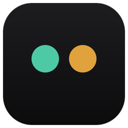

<div align="center">
  
  <h1>Meowo / 喵呜</h1>
  <p><b>一个常驻桌面的「贴纸」，把 Claude Code、Codex、Kimi 等 AI 编程会话的进度，一眼看全。</b></p>
  <p>
    <a href="https://github.com/larrygogo/meowo/actions/workflows/ci.yml"></a>
    <a href="https://github.com/larrygogo/meowo/releases/latest"></a>
    <a href="https://github.com/larrygogo/meowo/releases"></a>
    
    <a href="LICENSE"></a>
  </p>
  <p>哪个在跑、哪个在等你回复、各自做到哪一步——通过各 AI CLI 的 hooks 捕获每个会话的事件,<br/>落进本地 SQLite,再用一个半透明、可吸边的 Tauri 小窗口实时呈现。无需切来切去找终端。</p>
  
</div>

## 下载

| 平台 | 安装包 | 说明 |
|------|--------|------|
| **Windows** | [最新版 x64 安装包](https://github.com/larrygogo/meowo/releases/latest)(`meowo_x.y.z_x64-setup.exe`) | NSIS 安装包 |
| **macOS** | [最新版 universal DMG](https://github.com/larrygogo/meowo/releases/latest)(`meowo_x.y.z_universal.dmg`) | universal(Intel / Apple Silicon 通用),需 macOS ≥ 14 Sonoma;已签名公证,双击安装直接打开 |

链接指向最新 Release 页,进入后下载对应平台的安装包即可。装好后支持应用内(设置 → 关于)检查更新,两个平台均可自动升级到后续版本。

## 特性

### 📌 实时会话看板

- 每个 AI CLI 会话一张卡片：项目名、会话标题、**最近一条 AI 正文**（一眼知道它刚说了 / 在问你什么，尤其待交互时）、连接状态；Claude Code 会话还显示 **Context 已用百分比**（取自其 statusline 的准确值，1M 上下文窗口也能正确显示）。
- 状态分类 tab:全部 / 待交互 / 运行中 / 已归档,各带计数;状态指示一眼可辨——运行中(橙色转圈)、待交互(黄)、在线/闲置(绿)、已断开(虚线环)。「待交互」tab 内按**等待最久优先**排序,先处理被晾最久的。
- **搜索**:底栏放大镜一点,即时按会话标题 / 仓库名过滤,快速定位某个会话(在「已归档」tab 内则检索归档会话)。
- 初次启动自动导入近 7 天的历史会话(最多 30 条、最近优先,标记为已结束),一上来就有内容;无会话时按 tab 给出友好的空态引导。

### 🚀 点击直达终端

- 点**连接中**的会话直达它所在的终端——Windows 精确切到 Windows Terminal 对应标签页并置前窗口(正确处理一个 WT 进程托管多标签/多窗口的情况),macOS 通过 AppleScript 精确聚焦 Terminal / iTerm2 中对应的标签页。
- 点**已断开**的会话,在其原项目目录新开终端并 `claude --resume` 把对话续上;所用终端可在设置中指定——Windows 支持 Windows Terminal / PowerShell / 命令提示符,macOS 支持 Terminal / iTerm2(按本机实际安装自动过滤)。
- **打开方式可选**:默认点击卡片直达,也可在设置里改为卡片上单独的「打开」按钮(点卡片不再触发,避免误触)。
- 跳转与恢复均在后台执行,点完立即返回,贴纸不卡顿。

### 🔔 不漏掉任何等待

- 会话因工具调用解析失败 / 需要重新登录 / 认证失败而卡死时,卡片转红并归入「待交互」。
- 会话需要你回复(待交互)或出错时弹一条去重的系统通知(同一情形只弹一次),点击通知直接切到该会话的终端;设置里有总开关,默认开启。

### 🗂 卡片即点即管

- **星标置顶**:给重要会话加星,星标会话恒排在列表最前(金色描边高亮,跨重启保留)。
- **便签**:给会话挂一段本地备忘,常显在卡片上、随时编辑——纯本地、与会话内容无关,适合记「等 API key」「记得 review」之类。
- **改名**:在卡片上直接给会话改名,写入与 Claude Code `/rename` 一致的记录——贴纸和 `claude --resume` 列表同步显示新名字。
- **归档**:把会话收进「已归档」(可随时还原);设置中可让归档条目在 1 / 7 / 30 天后自动隐藏。
- 操作按钮(星标 / 便签 / 改名 / 归档)默认隐藏,**悬停卡片才浮现**,保持列表清爽。

### 🧲 吸边与窗口(仅 Windows)

- **吸边缩略**:把窗口拖到屏幕**左 / 右 / 顶**边缘松手即缩成一根缩略条(左右为竖条、顶为横条),只用状态色点表示各会话;悬停"偷看"展开、移开自动收回;拖离边缘恢复为普通窗口。吸附态自动置顶。
- 可手动 pin 让贴纸始终浮在最上层;重启沿用上次的窗口位置、尺寸与吸附边。

### 🍎 菜单栏面板(仅 macOS)

macOS 为状态栏(菜单栏)App——无独立浮窗/吸边/pin,应用不显示在 Dock:

- **左键**菜单栏图标弹出原生毛玻璃贴纸面板(不抢焦点、失焦自动收起),**右键**弹「设置 / 退出」。
- 图标实时显示「运行中」与「待交互(含出错)」会话计数,不展开面板也能一眼掌握状态。

<details>
<summary>macOS 首次使用的权限授权</summary>

首次点击「跳转/恢复终端」会触发 macOS「自动化」授权(系统设置 → 隐私与安全性 → 自动化),需允许 Meowo 控制 Terminal/iTerm2;首次通知会请求通知权限。授权弹窗期间应用保持响应,不影响贴纸正常使用。

</details>

### 🎨 外观与系统集成

- 深色 / 浅色 / 跟随系统三种主题,贴纸不透明度(60%–100%)与界面密度(紧凑 / 标准 / 宽松)可调,改动即时生效。
- Windows 托盘左键打开设置、右键「设置 / 退出」,**鼠标悬停托盘图标即见待交互 / 运行中会话数**,不开窗也能掌握状态;macOS 为菜单栏图标(左键面板、右键菜单)。开机自启等开关集中在设置页「通用」分区。

### 📊 账号与用量

- **贴纸内常显用量**:底栏一块凹陷小屏读数,实时显示 5 小时 / 7 天 / Opus 三档配额利用率(发光液柱、单色雕刻数字,越满越偏红),不打开设置也能一眼看配额。
- 设置页「账号」分区显示当前 Claude Code 账号、实时配额(5 小时 / 7 天总量及 Opus / Sonnet 分模型 7 天用量,重置时间精确到钟点)、以及 GitHub 贡献图风格的每日用量热力图;用量先显示缓存再后台刷新,登录 token 过期自动续期。

### 🔌 零配置接入

启动时自动把 meowo-reporter 幂等接入 Claude Code 设置(hooks + statusLine),先备份、原子写、不破坏已有配置;装好即用,无需手动挂 hooks。

## 为什么叫 Meowo?

名字来自猫叫 **meow**，中文译作「喵呜」。

Meowo 像一只猫蹲在屏幕角落：不吵不闹，却用那双发亮的眼睛盯着所有 AI 会话——哪个在跑、哪个在等你、哪个出了错，都逃不过它。

## 工作原理

> 以 Claude Code 为例；Codex / Kimi 走各自 CLI 的 hook 机制，数据最终都汇聚到同一份本地数据库。

```
 Claude Code 会话
   │  触发 hooks(SessionStart / UserPromptSubmit / PostToolUse / Stop / SessionEnd …)
   │  渲染 statusline(包装脚本把数据喂给 meowo-reporter statusline,取得准确的 Context 百分比)
   ▼
 meowo-reporter(命令行,读 stdin 的事件 JSON)
   │  解析事件、标题、项目、todo、Context 用量
   ▼
 ~/.meowo/board.db(SQLite,WAL)
   ▲
   │  文件监听 + 去抖刷新(notify)
 meowo-app(Tauri 贴纸,React 前端)
```

- **meowo-reporter** 是无状态的一次性进程：Claude Code 每次触发 hook 都会启动它，它读取事件、写库后立即退出，绝不阻塞会话。
- **meowo-app** 启动时监听 `~/.meowo/` 目录变化，库一变就刷新 UI；同时跑后台任务标记空闲会话、首次导入历史会话。
- 两端只通过这块 SQLite 通信，互不直接依赖运行时。

## 项目结构

```
meowo/
├── crates/
│   ├── meowo-store/        # SQLite 读写 + transcript 标题解析(被 reporter 和 app 共用)
│   └── meowo-reporter/     # AI CLI hooks 上报器(lib + bin)+ statusline 子命令 + 首次导入逻辑
├── app/
│   ├── src/             # React 前端(Sticker 贴纸视图、吸边状态机、设置页、平台分流)
│   └── src-tauri/       # Tauri 桌面壳(窗口、托盘、吸边、账号用量、AI CLI 自动接线;macos/ 为状态栏面板/托盘/终端跳转/通知)
├── scripts/
│   └── install-hooks.mjs  # 把 meowo-reporter 幂等挂进 Claude Code 的 settings.json
└── docs/                # 设计文档与实现计划
```

**技术栈**:Rust(Tauri v2 + rusqlite)、React 18 + TypeScript + Vite、Bun(包管理 + 运行)。

## 环境要求

- [Rust](https://rustup.rs/)(stable)
- [Bun](https://bun.sh/)
- Windows 上的 Tauri 前置依赖:**WebView2 Runtime**(Win11 自带)、**MSVC 构建工具**(Visual Studio Build Tools,含 C++ 桌面开发)。详见 [Tauri 前置依赖](https://tauri.app/start/prerequisites/)。
- macOS 上的前置依赖:**Xcode 命令行工具**(`xcode-select --install`);如需本地构建 universal 包,另需 `rustup target add aarch64-apple-darwin x86_64-apple-darwin`。
- 一个装好的 AI 编程 CLI（[Claude Code](https://docs.claude.com/en/docs/claude-code) / Codex / Kimi，用于产生会话事件）。

## 快速开始

```bash
# 1. 装前端依赖
cd app
bun install

# 2. 开发模式运行(含热更新;首次会编译 Rust,稍慢)
bun run tauri dev
```

构建发布版安装包:

```bash
cd app
bun run tauri build
# 产物在仓库根 target/release/bundle/ 下(Windows 为 NSIS 安装包,macOS 为 dmg/app)
```

## 接入 Claude Code

贴纸要有数据,得把 `meowo-reporter` 挂到 Claude Code 的 hooks 上。

> **使用安装包时通常无需手动操作**:meowo-app 每次启动会自动幂等地把 meowo-reporter 接入 `~/.claude/settings.json`——补齐所需的若干 hook 事件,并把 statusLine 包装成 `~/.meowo/statusline.sh` 以获取准确的 Context 百分比(你原有的 statusLine 会被保留并继续生效)。全程先备份、原子写、已正确则一字不改。前提是 `~/.claude/settings.json` 已存在(运行过一次 Claude Code 即会生成),应用不会代为创建。

<details>
<summary>手动挂 hooks(可选:不启动 app 就先挂、或写入自定义 settings 路径)</summary>

```bash
# 1. 编译 meowo-reporter
cargo build --release -p meowo-reporter
# 产物:target/release/meowo-reporter.exe

# 2. 把它幂等写进 ~/.claude/settings.json 的 hooks(用绝对路径)
bun scripts/install-hooks.mjs "<仓库绝对路径>/target/release/meowo-reporter.exe"
```

脚本会把 meowo-reporter 挂到所需的 hook 事件上（SessionStart / UserPromptSubmit / PostToolUse / Stop / SessionEnd / PermissionRequest，以及 PreToolUse 的 AskUserQuestion / ExitPlanMode，均带 5s 超时上限）。用同一路径重复运行不会重复追加、也不破坏你已有的其它 hooks;若更换了 reporter 路径,旧条目需手动清理(或直接启动 app,由自动接线原地更新路径)。

> 此脚本仅用于 Claude Code（写入 `~/.claude/settings.json`）。codex / kimi 的接入走各自 CLI 的原生 hook 配置（其 hook 命令带 `--provider codex|kimi`），不经本脚本。

也可指定写入别的 settings 文件:`bun scripts/install-hooks.mjs <reporter路径> <settings路径>`,或用环境变量 `MEOWO_SETTINGS`。

</details>

挂好后,新开的 Claude Code 会话就会实时出现在贴纸里。

## 数据与配置

<details>
<summary>数据与配置文件位置</summary>

- **数据库**:`~/.meowo/board.db`(SQLite,WAL 模式)。可用环境变量 `MEOWO_DB` 覆盖路径(reporter 与 app 都遵循)。
- **应用设置**:`~/.meowo/settings.json`(通知开关、主题、不透明度、界面密度、归档自动隐藏天数、恢复终端、打开终端方式、最近 AI 正文显示开关)。
- **用量缓存**:`~/.meowo/usage-cache.json`(账号用量数据的本地缓存)。
- **statusLine 包装脚本**:`~/.meowo/statusline.sh`(由 app 自动生成与维护,无需手改)。
- **首次导入标记**:`~/.meowo/imported.json`(存在即跳过再次导入)。删掉它可让下次启动重新导入近期历史会话。
- **前端本地状态**(localStorage):当前 tab、吸附边、记忆的正常窗口尺寸、置顶偏好、会话星标。

</details>

## 测试

```bash
# Rust(全 workspace)
cargo test --workspace
cargo clippy --workspace -- -D warnings

# 前端
cd app
bunx tsc --noEmit
bunx vitest run
```

> 演示 GIF 可一键重新生成:`cd app && bun run demo:gif`(Playwright 驱动 `demo.html` 合成,产物写到 `docs/images/demo.gif`)。

## 路线

- [x] CI(GitHub Actions:cargo test/clippy + 前端 tsc/vitest,windows-latest + macos-latest)
- [x] 在线更新(`tauri-plugin-updater` + tag 触发的 GitHub Releases,Windows NSIS / macOS app.tar.gz 双平台)
- [x] macOS 打包(universal dmg,签名公证 + 自动更新)
- [ ] Linux 打包

设计与实现细节见 [`docs/superpowers/`](docs/superpowers/)。

## License

[MIT](LICENSE) © larrygogo
