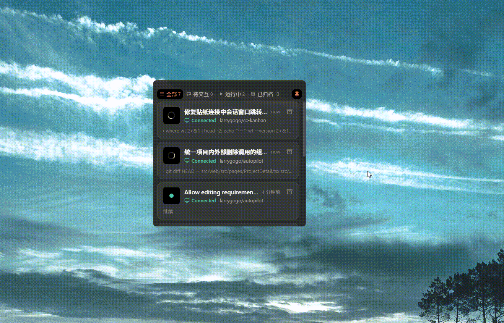

# cc-kanban

[](https://github.com/larrygogo/cc-kanban/actions/workflows/ci.yml)
[](LICENSE)

> 一个常驻桌面的「贴纸」，实时显示你所有 Claude Code 会话的进度——哪个在跑、哪个在等你回复、各自做到哪一步，一眼看全。

cc-kanban 通过 Claude Code 的 hooks 捕获每个会话的事件，落进本地 SQLite，再用一个半透明、可吸边的 Tauri 小窗口（贴纸）实时呈现。无需切来切去找终端，进度自动浮现在屏幕角落。

> 目前面向 **Windows**（macOS/Linux 打包暂未做）。

<p align="center">
  
</p>

---

## 下载

直接下载 [v0.1.2 安装包](https://github.com/larrygogo/cc-kanban/releases/download/v0.1.2/cc-kanban_0.1.2_x64-setup.exe)，或到 [Releases](https://github.com/larrygogo/cc-kanban/releases/latest) 获取最新的 `cc-kanban_x.y.z_x64-setup.exe`（NSIS 安装包）。装好后支持应用内/托盘检查更新，自动升级到后续版本。

---

## 特性

- **实时会话贴纸**：每个 Claude Code 会话一张卡片，显示项目名、当前标题/动作、todo 进度、连接状态。
- **状态分类 tab**：全部 / 待交互 / 运行中 / 已归档，并各带计数。
- **状态指示**：运行中（橙色转圈）、待交互（黄）、在线/闲置（绿）、已断开（虚线环）。
- **错误提醒**：会话因工具调用解析失败 / 需要重新登录 / 认证失败而卡死时，卡片转红并归入「待交互」，同时弹一条去重的桌面通知（同一错误只弹一次）。
- **点击跳转 / 恢复**：点**连接中**的会话，精确切到它所在的 Windows Terminal 标签页并置前窗口（正确处理一个 WT 进程托管多标签/多窗口的情况）；点**已断开**的会话，在其原项目目录新开一个终端标签页并 `claude --resume` 把对话续上。
- **吸边缩略**：把窗口拖到屏幕**左 / 右 / 顶**边缘松手即缩成一根缩略条（左右为竖条、顶为横条），只用状态色点表示各会话；悬停"偷看"展开、移开自动收回；拖离边缘恢复为普通窗口。吸附态自动置顶。
- **窗口置顶**：可手动 pin 让贴纸始终浮在最上层。
- **首次导入**：初次启动自动导入近 7 天的历史会话（标记为已结束），让你一上来就有内容。
- **空态引导**：无会话时按 tab 给出友好的图标 + 提示。
- **系统托盘**：显示/隐藏贴纸、开机自启开关、退出。
- **位置/尺寸记忆**：重启沿用上次的窗口状态与吸附边。

---

## 工作原理

```
 Claude Code 会话
   │  触发 hooks（SessionStart / UserPromptSubmit / PostToolUse / Stop / SessionEnd）
   ▼
 cc-reporter（命令行，读 stdin 的事件 JSON）
   │  解析事件、标题、项目、todo
   ▼
 ~/.cc-kanban/board.db（SQLite，WAL）
   ▲
   │  文件监听 + 去抖刷新（notify）
 cc-app（Tauri 贴纸，React 前端）
```

- **cc-reporter** 是无状态的一次性进程：Claude Code 每次触发 hook 都会启动它，它读取事件、写库后立即退出，绝不阻塞会话。
- **cc-app** 启动时监听 `~/.cc-kanban/` 目录变化，库一变就刷新 UI；同时跑后台任务标记空闲会话、首次导入历史会话。
- 两端只通过这块 SQLite 通信，互不直接依赖运行时。

---

## 项目结构

```
cc-kanban/
├── crates/
│   ├── cc-store/        # SQLite 读写 + transcript 标题解析（被 reporter 和 app 共用）
│   └── cc-reporter/     # CC hooks 上报器（lib + bin）+ 首次导入逻辑
├── app/
│   ├── src/             # React 前端（Sticker 贴纸视图、吸边状态机、CollapsedStrip 缩略条）
│   └── src-tauri/       # Tauri 桌面壳（窗口、托盘、吸边命令、后台任务）
├── scripts/
│   └── install-hooks.mjs  # 把 cc-reporter 幂等挂进 Claude Code 的 settings.json
└── docs/                # 设计文档与实现计划
```

**技术栈**：Rust（Tauri v2 + rusqlite）、React 18 + TypeScript + Vite、Bun（包管理 + 运行）。

---

## 环境要求

- [Rust](https://rustup.rs/)（stable）
- [Bun](https://bun.sh/)
- Windows 上的 Tauri 前置依赖：**WebView2 Runtime**（Win11 自带）、**MSVC 构建工具**（Visual Studio Build Tools，含 C++ 桌面开发）。详见 [Tauri 前置依赖](https://tauri.app/start/prerequisites/)。
- 一个装好的 [Claude Code](https://docs.claude.com/en/docs/claude-code)（用于产生会话事件）。

---

## 快速开始

```bash
# 1. 装前端依赖
cd app
bun install

# 2. 开发模式运行（含热更新；首次会编译 Rust，稍慢）
bun run tauri dev
```

构建发布版安装包（NSIS）：

```bash
cd app
bun run tauri build
# 产物在 app/src-tauri/target/release/bundle/ 下
```

---

## 接入 Claude Code（关键步骤）

贴纸要有数据，得先把 `cc-reporter` 挂到 Claude Code 的 hooks 上。

```bash
# 1. 编译 cc-reporter
cargo build --release -p cc-reporter
# 产物：target/release/cc-reporter.exe

# 2. 把它幂等写进 ~/.claude/settings.json 的 hooks（用绝对路径）
bun scripts/install-hooks.mjs "<仓库绝对路径>/target/release/cc-reporter.exe"
```

脚本会给 `SessionStart / UserPromptSubmit / PostToolUse / Stop / SessionEnd` 五个事件挂上 `cc-reporter`（带 5s 超时上限），重复运行只会更新自身条目、不破坏你已有的其它 hooks。

> 也可指定写入别的 settings 文件：`bun scripts/install-hooks.mjs <reporter路径> <settings路径>`，或用环境变量 `CC_KANBAN_SETTINGS`。

挂好后，新开的 Claude Code 会话就会实时出现在贴纸里。

---

## 数据与配置

- **数据库**：`~/.cc-kanban/board.db`（SQLite，WAL 模式）。可用环境变量 `CC_KANBAN_DB` 覆盖路径（reporter 与 app 都遵循）。
- **首次导入标记**：`~/.cc-kanban/imported.json`（存在即跳过再次导入）。删掉它可让下次启动重新导入近期历史会话。
- **前端本地状态**（localStorage）：当前 tab、吸附边、记忆的正常窗口尺寸、置顶偏好。

---

## 测试

```bash
# Rust（全 workspace）
cargo test --workspace
cargo clippy --workspace -- -D warnings

# 前端
cd app
bunx tsc --noEmit
bunx vitest run
```

---

## 路线

- [x] CI（GitHub Actions：cargo test/clippy + 前端 tsc/vitest，windows-latest）
- [x] 在线更新（`tauri-plugin-updater` + tag 触发的 GitHub Releases，NSIS 安装包）
- [ ] macOS / Linux 打包

设计与实现细节见 [`docs/superpowers/`](docs/superpowers/)。

## License

[MIT](LICENSE) © larrygogo
